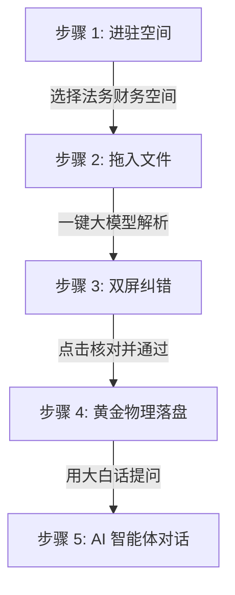

# 🚀 BQCA 智能物理数仓中台 ── 快速上手保姆指南 (Getting Started Guide)

欢迎使用 **BQCA (BigQuery Agent + Gemini) 智能中台系统** ！！！

---

## 🗺️ 一、 BQCA 系统是做什么的？(System Overview)

**BQCA (BigQuery Agent + Gemini) 智能物理数仓中台** 是专为**财务、法务、采购、HR及合规审计人员**打造的“黑科技”级 **非结构化文档资产化管理与智能对话平台**。

在传统企业中，高达 80% 的核心业务数据都“死”在 PDF、图片、Word、Excel 等零散文件中，难以进行结构化分析与统计。BQCA 彻底打通了**“非结构化原始文件 ➔ 大模型结构化提取 ➔ 人工核对（HIL）双轨落库 ➔ 物理数仓归档 ➔ 智能体（Agent）自然语言对话”** 的无损资产化闭环：


### 🌟 核心杀手级亮点
1. **多模态智能穿透**：底层搭载 Google Gemini 顶级多模态大模型，像“人类专家眼光”一样通读并提取合同主体、交货期、发票金额、简历技术栈等，自动归纳为标准表格，彻底告别手动打字录入。
2. **人工核对 (Human-in-the-Loop) 极高保真面板**：大模型抽取有 1% 误差都不行！系统独创双屏对账：**左屏高亮原文证据链（Evidence）**，**右屏实时订正纠错**，确保最终入库数据 100% 精准无损。
3. **物理数仓极速归档**：一键审核通过，文件全自动从待处理区“搬家”到云端冷归档区（Archive），同时以 **SQL MERGE 语句** 物理写入 Google BigQuery 实体表中，并根据创建时间自动进行分区剪裁（`PARTITION BY DATE`），**数据量再大也能暴降 90% 查询账单**。
4. **对话式商业智能 (Conversational BI)**：数据落库后，用户不需要懂任何 SQL、不需要看复杂的报表，直接在右侧像聊天一样用**大白话**提问，BQCA 智能体一秒内自动编译并执行 SQL，反馈完美的审计分析。

---

## 🛠️ 二、 使用前的准备工作 (Prerequisites)

为了保证本系统能在您的本地或服务器上顺利启动，并完美连通 Google Cloud 物理数仓环境，请在启动前确认以下准备工作：

### 1. 🖥️ 运行环境准备
* **Python 版本**：推荐使用 **Python 3.10 - 3.14** 运行环境。
* **Node.js (前端)**：如需本地开发编译，可备有 Node.js 16+ 环境（常规双击 HTML 打开或本地简单 HTTP 服务器亦可正常使用）。

### 2. 🔑 谷歌云 (GCP) 凭证与 IAM 权限授权
本系统通过 Google Cloud 官方 SDK 与您的云端资源进行物理交互，因此必须具备相关的 GCP 账号权限。
*   **本地开发/演示环境配置 (ADC 推荐)**：
    请确保您的电脑上已安装并配置了 **Google Cloud CLI (`gcloud`)**，并在终端中执行以下命令以完成本地应用默认凭证登录：
    ```bash
    gcloud auth application-default login
    ```
*   **企业生产/服务账号 (Service Account 推荐)**：
    如果您在云端部署，可以通过设置环境变量指向服务账号 JSON 密钥路径：
    ```bash
    export GOOGLE_APPLICATION_CREDentials="/path/to/your/service-account.json"
    ```
*   **账户所必须具备的 GCP IAM 权限**：
    *   **Google Cloud Storage (GCS)**：需要对目标存储桶具备写入与读取权限（建议赋予 `Roles/storage.objectAdmin` 或 `Roles/storage.admin`）。
    *   **Google BigQuery**：需要具备在指定数据集中建表、写入、查询的权限（建议赋予 `Roles/bigquery.admin` 或 `Roles/bigquery.dataEditor`）。
    *   **Dialogflow / Discovery Engine**：需要具备调用相关智能体进行交互绑定的权限（建议赋予 `Roles/dialogflow.admin` 或 `Roles/discoveryengine.admin`）。

### 3. 📝 环境变量或配置文件对账
请检查项目根目录下或 `backend/config.py` 中的关键配置参数是否与您的真实 GCP 项目完全对齐：
*   `GCP_PROJECT`：您的谷歌云项目 ID（例如：`webeye-internal-test`）
*   `GCS_BUCKET`：供网盘上传文件的 GCS 存储桶名称（例如：`bqca-demo`）
*   `BQ_DATASET`：BigQuery 临时和正式表驻留的 Dataset 名称（系统会根据 `workspace_id` 在其下自动创建对应表，例如 `workspace_demo_001`）

### 4. 🗄️ SQLite 缓存底座初始化
*   系统会使用本地 SQLite 数据库作为 Pending 数据的容灾一级缓存，该数据库位于 `backend/data/metadata.db`。
*   **自愈功能**：系统启动时，会自动检测并对齐最新的四大内置黄金模版（合同、简历、发票、出院单等），无需手动创建或配置。

---

## 🗺️ 三、 BQCA 五步通关极速旅程 (The Golden Path)

在完成上述准备并启动系统后，您可以直接按照以下 5 个极其简单的动作进行演示与操作：



---

## 🚀 四、 手把手保姆级实操步骤

### 🎯 步骤 1：进驻您的“专属智能空间”
*   **动作**：打开 BQCA 前端网页，在页面左上角的下拉菜单中，选择一个空间（例如：`(saas_audit_demo) 2026法务与财务智能核对空间`）。
*   **小白心法**：**“空间”就是您的专属物理隔离数仓**。不同的空间之间数据物理隔离，采购数据绝不会混进简历数据里，保障 100% 的 SaaS 安全级防泄密。

### 🎯 步骤 2：拖入并上传您的非结构化文档
*   **动作**：将您电脑里的 **合同、发票、求职简历、采购单**（支持 PDF、JPG 图片、Word 格式），直接拖进网页的“拖拽上传区”中，或点击上传。
*   **小白心法**：上传完成后，这些文件会被安全地保存在您专属的 **Google Cloud Storage (GCS) 云端智能保险箱** 中，等待大模型调遣。

### 🎯 步骤 3：大模型“一键穿透提取”（100% 自动拆列）
*   **动作**：点击页面右侧耀眼的 **【一键大模型提取 & 绑定 BQCA】** 按钮。
*   **黑科技亮点**：
    *   系统会自动拉起 Gemini 顶级多模态大模型，**像人眼一样去“阅读”您的每一份文件 ！！！**
    *   无论是合同的采购主体、交货期限，还是发票的含税金额、简历的求职岗位，系统都会**自动把这些躲在文件深处的非结构化文字挖出来，拆成整整齐齐的表格列 ！！！**

> [!TIP]
> **🚀 前端智能渐进式轮询保护**
> BQCA 的前端拥有智能退避算法。对于小文件（如一张发票），它会在 2-4 秒内极速刷新呈递结果；对于大文件，它会自动拉长轮询间隔，保护您的网络和服务器不被卡死 ！

### 🎯 步骤 4：双屏对账与“一锤定音”人工核对 (Human-in-the-Loop)
*   **动作**：在“待审核列表”中，点击每一行右侧的 **【核对并通过】**。
*   **双屏震撼视觉**：
    *   页面会瞬间展开一个极其震撼的**“双屏核对弹窗”** ！！！
    *   **左半屏**：直接高亮投射大模型在 PDF 中找到这笔数据的**原文依据（Evidence 证据链）**。大模型绝不瞎编、绝不幻觉，指哪看哪 ！
    *   **右半屏**：允许您直接在输入框中对不完美的标题、金额进行微调 and 订正。
    *   **一键核对**：点击底部的【确认核对并通过】。

### 🎯 步骤 5：流式 Merge 落库 ── 注入黄金物理历史大表 
*   **动作**：核对通过后，该文件会自动从“待审核”队列中消失，并优雅地划线归档到下方的 **【已审核黄金物理历史大表】** 中。
*   **小白心法**：
    *   此时，这条完美数据已经通过 **SQL MERGE 语句** 物理写入了您的 Google BigQuery 物理历史主表中。
    *   **底层黑科技 ➔ 自升级自愈防线**：如果您的 BigQuery 历史老表中缺少最新的 `created_at` 分区列，后端内置的自愈防线会自动执行 `ALTER TABLE` 在线扩充升级并顺畅写入，无需人工干预 ！！！
    *   **底层黑科技 ➔ 自适应时间分区**：我们为您开启了 `PARTITION BY DATE(created_at)`。即使后续落库了上亿条历史数据，未来的查询开销和账单也能**暴降 90% ！！！**

---

## 🗣️ 五、 终极奥义：呼叫 BQCA 智能体，用“大白话”做数据审计 ！！！

数据落库后，您就不需要再触碰任何表格了 ！！！

在前端右侧的 **BQCA 智能体对话框** 中，您可以直接像和真人助理聊天一样，输入任何大白话来提问：

### 💬 财务审计场景：
> 🙋‍♂️ *“帮我查一下 2026 年 saas_audit_demo 空间内，已经核对的所有采购合同总金额是多少？”*
> 🤖 **BQCA**：一秒内自动生成并执行 SQL `SELECT SUM(amount) FROM ...` ➔ *“首长，已核对的合同总金额为 **589,400 CNY** ！”*

### 💬 法务合规场景：
> 🙋‍♂️ *“有没有哪些合同的最晚交货期快到了，但我们还没有付款的？”*
> 🤖 **BQCA**：穿透 JSON 字段，精准排查 ➔ *“首长，为您发现 2 笔高风险合同：1) 恒力采购合同，最晚交货期为 2026-08-01 ；2) ...”*

---

## 🛡️ 六、 容灾与双重缓存说明

> [!IMPORTANT]
> **💡 双重保险 ── 内存 + SQLite 双级缓存**
> 很多小白担心：“要是我网断了、电脑突然没电了、或者服务器重启了，我刚刚好不易用大模型提出来的 Pending 数据是不是就丢了，又得重新花一遍大模型 Token 钱？”
> **答案是：绝对不会 ！！！**
> 每一个分析出来的字，在第 1 微秒不仅活在内存里，也**早已 100% 同步备份写盘进了系统的 SQLite 物理数据库中** ！！！刷新后，数据 1 毫秒内原地复活 ！！！

---

祝您在 BQCA 智能物理数仓中台的阅兵和演示中取得圆满成功 ！！！
如有任何疑问，请随时批示 ！！！🫡
