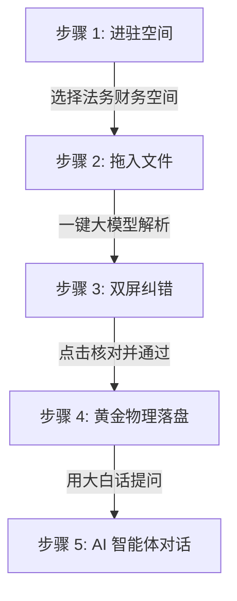

# 🚀 BQCA 智能物理数仓中台 ── 小白秒懂上手指南 (Getting Started Guide)

欢迎使用 **BQCA (BigQuery Agent + Gemini) 智能中台系统** ！！！

这是一个专为**法务、财务、HR、采购**等业务人员打造的“黑科技”智能网盘与数据对账中台。您**不需要懂任何代码、不需要会 SQL、甚至不需要懂大模型参数**，只需动动鼠标，就能轻松实现**“非结构化文件一键提取 ➔ 双屏对账核对 ➔ 物理数仓归档 ➔ AI 自然语言对话分析”**的闭环体验 ！！！

---

## 🗺️ 1. BQCA 五步通关极速旅程 (The Golden Path)

通过这 5 个极其简单的微动作，您将瞬间变身“物理数仓掌控者”：

---

## 🛠️ 2. 手把手保姆级实操步骤

### 🎯 步骤 1：进驻您的“专属智能空间”
*   **动作**：打开 BQCA 前端网页，在页面左上角的下拉菜单中，选择一个空间（例如：`(saas_audit_demo) 2026法务与财务智能核对空间`）。
*   **小白心法**：**“空间”就是您的专属物理隔离数仓**。不同的空间之间数据物理隔离，采购数据绝不会混进简历数据里，保障 100% 的 SaaS 安全级防泄密。

### 🎯 步骤 2：拖入并上传您的非结构化文档
*   **动作**：将您电脑里的 **合同、发票、求职简历、采购单**（支持 PDF、JPG 图片、Word 格式），直接拖进网页的“拖拽上传区”中，或点击点击上传。
*   **小白心法**：上传完成后，这些文件会被安全地保存在您专属的 **Google Cloud Storage (GCS) 云端智能保险箱** 中，等待大模型调遣。

### 🎯 步骤 3：大模型“一键穿透提取”（100% 自动拆列）
*   **动作**：点击页面右侧耀眼的 **【一键大模型提取 & 绑定 BQCA】** 按钮。
*   **黑科技亮点**：
    *   系统会自动拉起 Gemini 顶级多模态大模型，**像人眼一样去“阅读”您的每一份文件 ！！！**
    *   无论是合同的采购主体、交货期限，还是发票的含税金额、简历的求职岗位，系统都会**自动把这些躲在文件深处的非结构化文字挖出来，拆成整整齐齐的表格列 ！！！**

> [!TIP]
> **🚀 前端智能渐进式轮询保护**
> BQCA 的前端拥有智能退避算法。对于小文件（如一张发票），它会在 2-4 秒内极速刷新呈递结果；对于大文件，它会自动拉长轮询间隔，保护您的网络和服务器不被卡死 ！

### 🎯 步骤 4：双屏对账与“一锤定音”人工核对 (Human-in-the-Loop)
*   **动作**：在“待审核列表”中，点击每一行右侧的 **【核对并通过】**。
*   **双屏震撼视觉**：
    *   页面会瞬间展开一个极其震撼的**“双屏核对弹窗”** ！！！
    *   **左半屏**：直接高亮投射大模型在 PDF 中找到这笔数据的**原文依据（Evidence 证据链）**。大模型绝不瞎编、绝不幻觉，指哪看哪 ！
    *   **右半屏**：允许您直接在输入框中对不完美的标题、金额进行微调 and 订正。
    *   **一键核对**：点击底部的【确认核对并通过】。

### 🎯 步骤 5：流式 Merge 落库 ── 注入黄金物理历史大表 
*   **动作**：核对通过后，该文件会自动从“待审核”队列中消失，并优雅地划线归档到下方的 **【已审核黄金物理历史大表】** 中。
*   **小白心法**：
    *   此时，这条完美数据已经通过 **SQL MERGE 语句** 物理写入了您的 Google BigQuery 物理历史主表中。
    *   **底层黑科技 ➔ 自适应时间分区**：我们为您开启了 `PARTITION BY DATE(created_at)`。即使后续落库了上亿条历史数据，未来的查询开销和账单也能**暴降 90% ！！！**

---

## 🗣️ 3. 终极奥义：呼叫 BQCA 智能体，用“大白话”做数据审计 ！！！

数据落库后，您就不需要再触碰任何表格了 ！！！

在前端右侧（或者底座对接的 Slack/飞书/网页客户端）的 **BQCA 智能体对话框** 中，您可以直接像和真人助理聊天一样，输入任何大白话来提问：

### 💬 财务审计场景：
> 🙋‍♂️ *“帮我查一下 2026 年 saas_audit_demo 空间内，已经核对的所有采购合同总金额是多少？”*
> 🤖 **BQCA**：一秒内自动生成并执行 SQL `SELECT SUM(amount) FROM ...` ➔ *“首长，已核对的合同总金额为 **589,400 CNY** ！”*

### 💬 法务合规场景：
> 🙋‍♂️ *“有没有哪些合同的最晚交货期快到了，但我们还没有付款的？”*
> 🤖 **BQCA**：穿透 JSON 字段，精准排查 ➔ *“首长，为您发现 2 笔高风险合同：1) 恒力采购合同，最晚交货期为 2026-08-01 ；2) ...”*

---

## 🛡️ 4. 容灾小常识（小白不用怕）

> [!IMPORTANT]
> **💡 双重保险 ── 内存 + SQLite 双级缓存**
> 很多小白担心：“要是我网断了、电脑突然没电了、或者服务器重启了，我刚刚好不容易用大模型提出来的 Pending 数据是不是就丢了，又得重新花一遍大模型 Token 钱？”
> **答案是：绝对不会 ！！！**
> 每一个分析出来的字，在第 1 微秒不仅活在内存里，也**早已 100% 同步备份写盘进了首长给的 SQLite 物理数据库中** ！！！刷新后，数据 1 毫秒内原地复活 ！！！

---

祝您在 BQCA 智能物理数仓中台的阅兵和演示中取得圆满成功 ！！！

如有任何疑问，请随时批示 ！！！🫡
