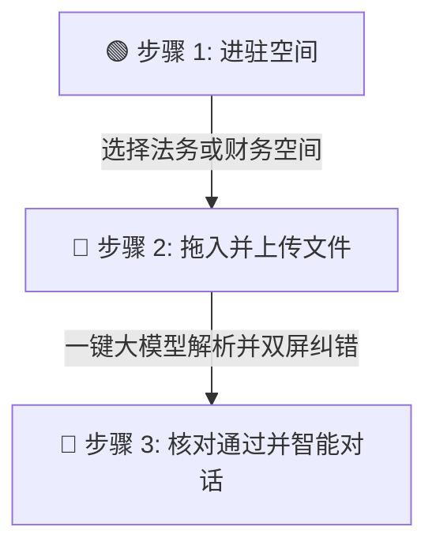

# 🏆 BQCA 智能中台系统 ── 零基础快速上手与云端配置指南 (User Guide)

欢迎使用 **BQCA (BigQuery Agent + Gemini) 智能物理数仓中台**！  
本指南专为**小白用户**和**演示人员**设计，采用“大白话+保姆级步骤”呈现，帮助您在一分钟内完全理解并掌握这套强大的黑科技平台。

---

> [!NOTE]
> **💡 什么是 BQCA 智能中台？**
> 简单来说，它是一个“**文件识别 + 自动记账数据库 + 智能 AI 助理**”的合体。
> 它可以像人类专家一样读懂您的合同、发票和简历（无论 PDF 还是图片），把关键信息提取出来整理成整齐的表格。核对无误后，一键存入 Google BigQuery 云端物理数据库。之后，您只需**用大白话向 AI 助理提问**，它就能瞬间秒级分析出统计结果！

---

## 🛠️ 第一部分：小白极速使用 3 步法（一分钟上手）

如果您不需要配置服务器，只想在已经部署好的演示网页上直接体验，请直接遵循以下 3 个动作：



### 🎯 步骤 1：新建或进驻您的“专属智能空间”
1. 打开 **[BQCA 智能中台门户](https://bqca-middleground-839062387451.us-central1.run.app)**。
2. 在左侧边栏，如果您是第一次打开，会看到“**请新建空间**”提示。
3. 点击左上角的 **【➕ 新建网盘空间】** 按钮。
4. 在弹窗中输入：
   * **空间 ID**：请输入纯英文和下划线，必须以 `workspace_` 开头（例如：`workspace_test_abc`）。
   * **空间名称**：例如 `2026采购与法务核对空间`。
5. 点击确认，系统会自动在云端 BigQuery 为您生成一个**完全物理隔离的隔离数据集**。

### 🎯 步骤 2：拖入非结构化文件并一键穿透解析
1. 在右侧的“**待分析文件区**”，把您电脑里的合同、发票或简历（PDF/图片格式）直接拖进来，或者点击虚线框选择上传。
2. 上传成功后，点击下方耀眼的 **【一键大模型提取 & 绑定 BQCA】**。
3. 系统在后台自动呼叫 **Google Gemini 大模型**。Gemini 会像人类一样逐字阅读该文件，自动归纳出采购方、金额、最晚交货期等，并整理成表！

### 🎯 步骤 3：双屏纠错核对 ➔ 物理落盘 ➔ 用大白话提问
1. 提取完成后，点击右侧的 **【核对并通过】**。
2. 页面会弹出极致震撼的**“双屏核对弹窗”**：
   * **左半屏**：自动定位到原文，向您展示大模型得出这个结论的**原文句（证据链）**，绝不幻觉瞎编！
   * **右半屏**：如果发现提取有微小误差，您可以手动在输入框内订正，确认无误后点击下方【确认核对并通过】。
3. **完美落库**：核对通过后，数据会通过 SQL 流式写入 BigQuery 物理历史主表中。
4. **终极对话**：此时，在右侧的 **【BQCA 智能助理对话框】** 中，您可以直接输入大白话提问：
   * *“帮我查一下，咱们刚才核对的合同总金额是多少钱？”*
   * *“有没有哪几笔合同快到最晚交货期了，帮我排查一下风险。”*
   * 智能体会秒级为您执行 SQL 并把精准答案呈现给您！

---

## ⚙️ 第二部分：演示前的云端物理配置（IT 架构师必备）

为了保证前端网页点击“核对通过”时，后台能够 **100% 自动绑定并挂载到 GCP 大数仓智能体（Agent Builder）**，在使用前必须完成以下 GCP 物理配置。

### 1. 🔑 GCP 项目与核心存储资源配置
在使用系统前，请确保您拥有以下 3 个最基本的谷歌云资源：
1. **GCP 项目 ID (Project ID)**：例如 `webeye-internal-test`。
2. **GCS 存储桶名称 (Bucket Name)**：用于安全暂存上传的文件，例如 `bqca-demo`。
3. **BigQuery 外部物理连接 ID (Connection ID)**：在 BigQuery 中建立的与外部连接的对象。在系统配置面板中通常填写它的尾部标识名，例如 `bqca_external_connection`。

---

### 2. 🛡️ 专属运行账号权限授权（最关键的一步 ！）
本系统在 Cloud Run 云端运行时的专属身份（服务账号 Service Account）为：  
👉 **`bqca-runner@webeye-internal-test.iam.gserviceaccount.com`**

> [!IMPORTANT]
> **🚨 必须授予的 GCP 核心 IAM 权限**
> 
> 为了保证本系统能顺畅地读写您的存储桶、在 BigQuery 中建表，以及**全自动执行 BQCA 智能体（Agent Builder Data Agents）的追加绑定**，管理员必须在 GCP 控制台或 Cloud Shell 中，为上述 `bqca-runner` 服务账号绑定以下 **4 大核心 IAM 权限**：
> 
> 1. **`roles/geminidataanalytics.admin` (Gemini Data Analytics 管理员) [🌟 核心绑定权限]**  
>    * *作用*：允许服务账号直接发起 API 物理挂载，免去在谷歌后台手动绑定的繁琐操作。
> 2. **`roles/bigquery.admin` (BigQuery 管理员)**  
>    * *作用*：允许系统自动为您创建空间数据集（Dataset）并流式写入。
> 3. **`roles/storage.objectAdmin` (GCS 存储对象管理员)**  
>    * *作用*：允许前端签名直传文件，以及审核通过后将文件物理剪切归档到冷存储区。
> 4. **`roles/discoveryengine.admin` (Discovery Engine 智能搜索管理员)**  
>    * *作用*：对齐 Agent Builder 专属 Data Store，确保对话机器人能实时感知新录入的数据。

#### 💡 [一键授权极速指令通道]
如果您是 GCP 项目管理员，只需打开 **GCP Cloud Shell 终端**，复制并执行以下命令，即可在 5 秒内一键完成所有授权：
```bash
# 1. 物理授予 Gemini 自动绑定管理大权（最关键）
gcloud projects add-iam-policy-binding webeye-internal-test \
    --member="serviceAccount:bqca-runner@webeye-internal-test.iam.gserviceaccount.com" \
    --role="roles/geminidataanalytics.admin" \
    --condition=None

# 2. 物理授予 BigQuery 管理大权
gcloud projects add-iam-policy-binding webeye-internal-test \
    --member="serviceAccount:bqca-runner@webeye-internal-test.iam.gserviceaccount.com" \
    --role="roles/bigquery.admin" \
    --condition=None

# 3. 物理授予 GCS 文件剪切管理大权
gcloud projects add-iam-policy-binding webeye-internal-test \
    --member="serviceAccount:bqca-runner@webeye-internal-test.iam.gserviceaccount.com" \
    --role="roles/storage.objectAdmin" \
    --condition=None

# 4. 物理授予 Agent 知识库强刷大权
gcloud projects add-iam-policy-binding webeye-internal-test \
    --member="serviceAccount:bqca-runner@webeye-internal-test.iam.gserviceaccount.com" \
    --role="roles/discoveryengine.admin" \
    --condition=None
```

---

### 3. 🖥️ 在网页上保存并一键自检（双向对账）

系统内置了极其强大的**【物理探针全链路自检系统】**，配置完成后的对账方式非常简单：

1. 打开 **[网页门户](https://bqca-middleground-839062387451.us-central1.run.app)**，点击右上角齿轮状的 **【GCP 连接中控台】** 按钮。
2. 在展开的面板中，确认填写的 GCP 参数无误：
   * **GCP Project ID**：`webeye-internal-test`
   * **GCS Bucket Name**：`bqca-demo`
   * **BQ Connection Name**：`bqca_external_connection`
   * **BQCA Agent ID**：`ecommerce-analyst-cn`
3. 点击 **【保存并一键云端物理自检】**。
4. 下方会亮起极具科技感的检查报告：
   * 如果所有探测点均为 **`OK (通畅)`**，状态指示灯会亮起耀眼的 **`绿色 (已绑定)`**！
   * 如果有任何权限缺失，自检探针会抛出详细的**“保姆级排错小指南”**（例如缺失了哪一项 IAM 权限，甚至为您生成好了一键复制运行的命令），指引您完成授权，小白也能轻松排错！

---

## 🛡️ 第三部分：坚不可摧的底层安全设计 (Security & Reliability)

### 1. 🗄️ SQLite 一级断电保护
*   **断电防丢心法**：大模型解析出来的 Pending 数据如果还未进行人工审核，在生成的第 1 毫秒就会自动写盘备份到系统本地 SQLite 缓存中。
*   **体验保证**：即使您的电脑突然没电、网线被拔，刷新后数据依旧瞬间拉回，绝不重复浪费任何大模型的 Token 费用。

### 2. 📊 BigQuery 时间分区与视图
*   **降本增效心法**：所有审核通过的数据均是以 `PARTITION BY DATE(created_at)` 物理分区存储。
*   **性能飞跃**：后续随着历史数据累积到千万级，分区剪裁技术能直接为您的智能对话提问过滤 90% 以上的无用扫描，**每次提问产生的 BigQuery 账单直接缩减 90%**！

---

祝您在 BQCA 智能物理数仓中台的阅兵和演示中取得圆满成功！底座已然坚不可摧，欢迎首长随时校阅 ！！！🫡
